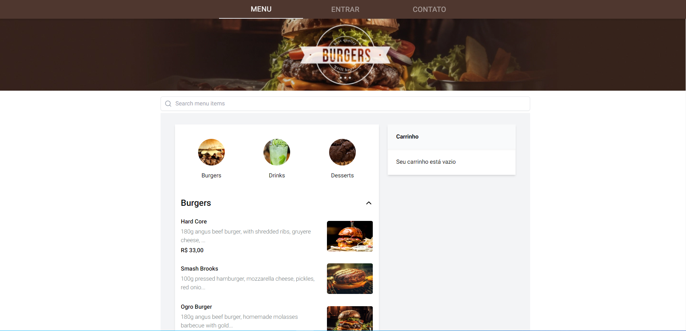
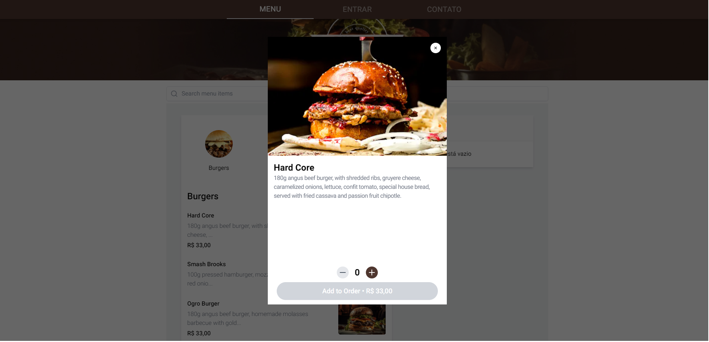
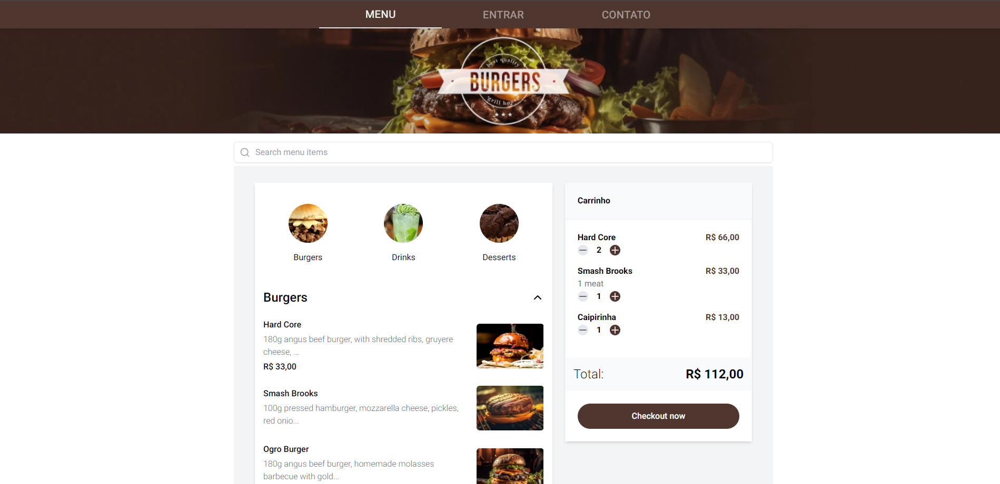

# Teste Frontend

Implementação de um restaurante com carrinho e gerenciamento de estado.


## Deploy

Para acessar esse projeto em produção acesse:

📍 <a href="https://experis.vercel.app/" target="_blank" > Teste Front-end</a>

# Layout

## Home
[]()

## Modal

[]()

## Cart

[]()


## Tecnologias utilizadas

- Nextjs
- React
- Typescript
- Javascript
- Tailwindcss
- Nookies
- Axios

## Observações Técnicas

- Para gerenciar de estado criei um gerenciador de estado usando apenas javascript e react.
- A escolha do framework next, deu por conta da api estar com erro de CORS, então optei por escolher algo que rode no servidor.

## Variáveis de Ambiente

Para rodar esse projeto, você vai precisar adicionar as seguintes variáveis de ambiente no seu .env.local

`NEXT_PUBLIC_API_URL=<check_.env-example>`


## Rodando Localmente

```bash
$ git clone https://github.com/zkauansantos/experis.git

$ cd experis

$ npm install ou yarn install

$ npm run dev ou yarn dev
```
